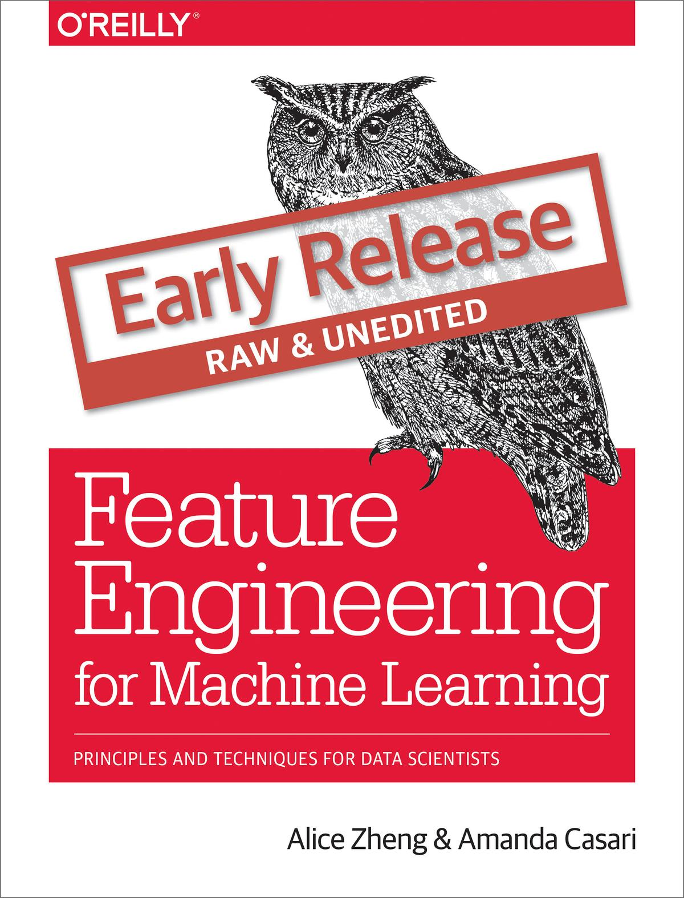

# 面向机器学习的特征工程



> 原文（注册后可阅读）：[Feature Engineering for Machine Learning (Early Release)](https://www.safaribooksonline.com/library/view/feature-engineering-for/9781491953235/)
> 
> 协议：[CC BY-NC-SA 4.0](http://creativecommons.org/licenses/by-nc-sa/4.0/)
> 
> **欢迎任何人参与和完善：一个人可以走的很快，但是一群人却可以走的更远**

* [在线阅读](http://fe4ml.apachecn.org)
* [在线阅读（Gitee）](https://apachecn.gitee.io/fe4ml-zh/)
* [ApacheCN 机器学习交流群 629470233](http://shang.qq.com/wpa/qunwpa?idkey=30e5f1123a79867570f665aa3a483ca404b1c3f77737bc01ec520ed5f078ddef)
* [ApacheCN 学习资源](http://www.apachecn.org/)
* [利用 Python 进行数据分析 第二版](https://github.com/apachecn/pyda-2e-zh)

## 目录

+   [一、引言](docs/1.引言.md)
+   [二、简单数字的奇特技巧](docs/2.简单数字的奇特技巧.md)
+   [三、文本数据：展开、过滤和分块](docs/3.文本数据.md)
+   [四、特征缩放的效果：从词袋到 TF-IDF](docs/4.特征缩放的效果：从词袋到_TF-IDF.md)
+   [五、类别特征：机器鸡时代的鸡蛋计数](docs/5.类别特征.md)
+   [六、降维：使用 PCA 压缩数据集](docs/6.降维：用_PCA_压缩数据集.md)
+   [七、非线性特征提取和模型堆叠](docs/7.非线性特征提取和模型堆叠.md)
+   [八、自动化特征提取器：图像特征提取和深度学习](docs/8.自动化特征提取器：图像特征提取和深度学习.md)
+   九、回到特征：将它们放到一起
+   [附录、线性模型和线性代数基础](docs/附录.线性模型和线性代数基础.md)

## 负责人

* [@飞龙](https://github.com/wizardforcel): 562826179

## 免责声明

ApacheCN 纯粹出于学习目的与个人兴趣翻译本书，不追求任何经济利益。

本译文只供学习研究参考之用，不得用于商业用途。ApacheCN 保留对此版本译文的署名权及其它相关权利。

## 下载

### Docker

```
docker pull apachecn0/fe4ml-zh
docker run -tid -p <port>:80 apachecn0/fe4ml-zh
# 访问 http://localhost:{port} 查看文档
```

### PYPI

```
pip install fe4ml-zh
fe4ml-zh <port>
# 访问 http://localhost:{port} 查看文档
```

### NPM

```
npm install -g fe4ml-zh
fe4ml-zh <port>
# 访问 http://localhost:{port} 查看文档
```

## 赞助我们


